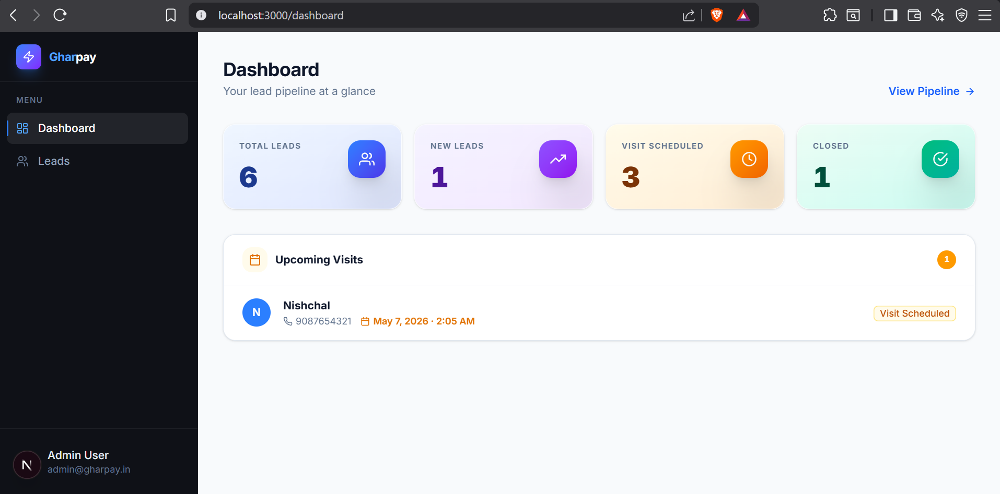
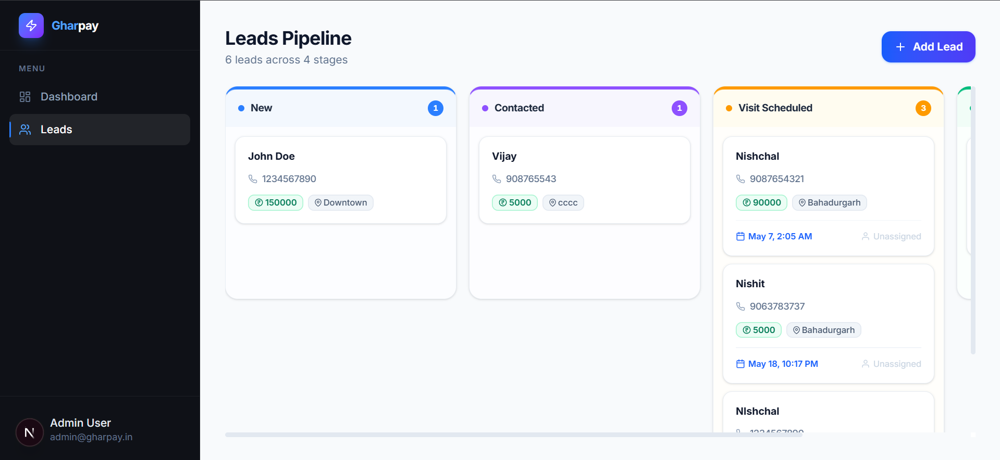
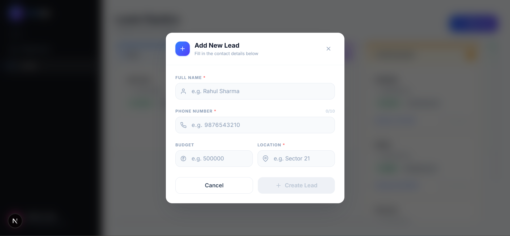
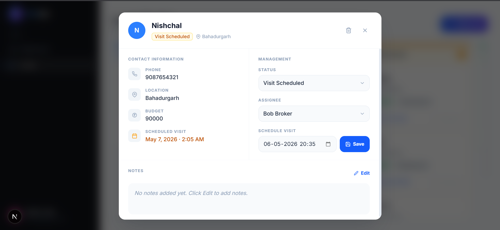
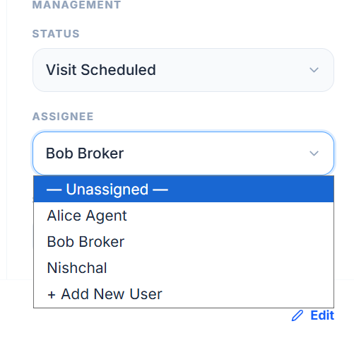
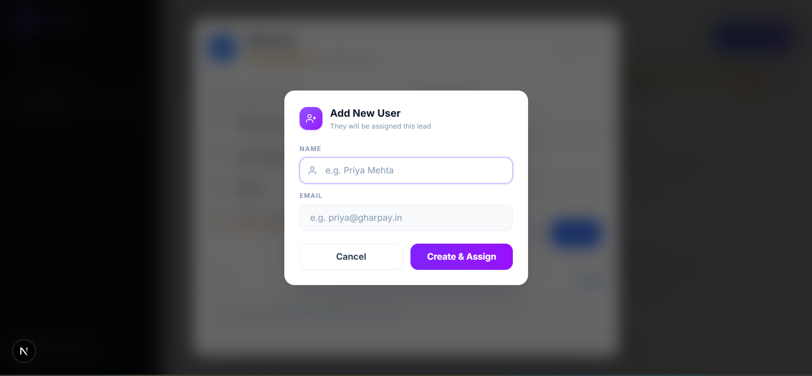

# Lead Management CRM MVP

> A full-stack CRM for capturing, tracking, and closing leads — built for speed, clarity, and scale.

---

## Overview

**Lead Management CRM** is a production-ready MVP designed for sales teams and property management companies to manage their entire lead lifecycle from initial contact through to a closed deal. It provides a structured pipeline, real-time ownership assignment, visit scheduling with date validation, and a dashboard with actionable summary metrics — all accessible through a clean, responsive web interface.

Built as a technical assignment, this project demonstrates real-world software engineering principles: a layered backend architecture, strict business rule enforcement, and a component-driven frontend.

---

## Features

### Lead Management
- Create leads with full contact details: name, phone, budget, location, and notes
- Update any field on an active lead
- Soft-delete leads via an `is_deleted` flag (data is never permanently lost)
- Filter leads by status or assigned owner; sort by creation date or visit date

### Pipeline Management
- Kanban board UI with leads grouped by status: `NEW → CONTACTED → VISIT_SCHEDULED → CLOSED`
- Drag-and-drop cards to transition leads between columns (powered by **dnd-kit**)
- Forward-only pipeline enforcement — leads cannot be moved backwards
- Status transitions validated server-side, not just on the frontend

### Ownership Assignment
- Assign any lead to a registered user (sales agent / broker)
- Update ownership dynamically at any point while the lead is active
- Assignment is required before a visit can be scheduled

### Visit Scheduling
- Schedule a site visit with a specific date and time
- Server-side validation: visit date **must** be in the future
- Scheduling a visit automatically transitions the lead to `VISIT_SCHEDULED`
- Leads without an assigned owner cannot be scheduled

### Dashboard
- Summary cards: Total Leads, New, Visit Scheduled, Closed
- Upcoming visits list with lead name, location, and scheduled date

---

## Tech Stack

### Frontend
| Technology | Purpose |
|---|---|
| **Next.js 16** (React 19) | App framework, routing, SSR |
| **Tailwind CSS v4** | Utility-first styling |
| **TanStack React Query v5** | Server-state management, caching, background refetching |
| **dnd-kit** | Accessible drag-and-drop for the Kanban board |
| **React Hook Form + Zod** | Form management and schema validation |
| **Axios** | HTTP client |
| **Lucide React** | Icon library |
| **react-hot-toast** | Non-blocking toast notifications |

### Backend
| Technology | Purpose |
|---|---|
| **FastAPI** | High-performance async REST API |
| **Pydantic v2** | Request/response schema validation and serialization |
| **Motor** | Async MongoDB driver |
| **Python-dotenv** | Environment variable management |
| **Uvicorn** | ASGI server |

### Database
| Technology | Purpose |
|---|---|
| **MongoDB** | Document store for flexible lead and user data |

---

## Architecture

The backend follows a strict **3-layer architecture** to keep concerns separated and the codebase maintainable as it grows:

```
HTTP Request
     │
     ▼
┌──────────────┐
│  API Layer   │  Route handlers (FastAPI routers). Validate HTTP input, call service.
└──────┬───────┘
       │
       ▼
┌──────────────┐
│ Service Layer│  Business logic, rule enforcement, orchestration.
└──────┬───────┘
       │
       ▼
┌──────────────┐
│ Repository   │  All MongoDB queries live here. Services never touch the DB directly.
│    Layer     │
└──────────────┘
```

**Why this structure?**
- **Testability**: The service layer can be unit-tested by mocking repositories.
- **Replaceability**: Swapping MongoDB for another database only requires changes to the repository layer.
- **Readability**: Any developer can find business rules in services and queries in repositories without hunting through the codebase.

---

## Database Design

### Collections

#### `leads`
| Field | Type | Description |
|---|---|---|
| `_id` | `ObjectId` | Auto-generated primary key |
| `name` | `string` | Lead's full name |
| `phone` | `string` | Contact number |
| `budget` | `float` | Budget in currency units |
| `location` | `string` | Area of interest |
| `status` | `enum` | `NEW`, `CONTACTED`, `VISIT_SCHEDULED`, `CLOSED` |
| `assigned_to` | `ObjectId` (ref: users) | ID of the assigned agent |
| `visit_date` | `datetime` | Scheduled visit timestamp (UTC) |
| `notes` | `string` | Free-text notes (editable even on closed leads) |
| `is_deleted` | `boolean` | Soft-delete flag (default: `false`) |
| `created_at` | `datetime` | UTC timestamp of creation |
| `updated_at` | `datetime` | UTC timestamp of last modification |

#### `users`
| Field | Type | Description |
|---|---|---|
| `_id` | `ObjectId` | Auto-generated primary key |
| `name` | `string` | Agent's full name |
| `email` | `string` | Unique email address |

All models use Pydantic v2 for runtime schema validation. MongoDB `ObjectId` types are handled via a custom `PyObjectId` serializer that safely converts to/from strings for JSON responses.

---

## Business Logic

The following rules are enforced server-side in the **Service Layer** and cannot be bypassed by manipulating the frontend:

| Rule | Enforcement |
|---|---|
| Pipeline is forward-only | Status order is numerically ranked; backward transitions raise HTTP 400 |
| Visit scheduling requires an owner | `assigned_to` must be set before `schedule_visit` is called |
| Visit date must be in the future | `visit_date <= now` raises HTTP 400 |
| Closed leads are read-only | Any update to a `CLOSED` lead (except `notes`) raises HTTP 400 |
| Soft delete only | `DELETE /leads/{id}` sets `is_deleted: true`; data is preserved |
| User must exist before assignment | Owner ID is validated against the `users` collection |

---

## API Reference

Base URL: `http://localhost:8000/api/v1`

Interactive documentation is auto-generated by FastAPI and available at:
- **Swagger UI**: `http://localhost:8000/api/v1/openapi.json` → `http://localhost:8000/docs`
- **ReDoc**: `http://localhost:8000/redoc`

### Leads
| Method | Endpoint | Description |
|---|---|---|
| `GET` | `/leads` | List all leads (supports filtering & sorting) |
| `POST` | `/leads` | Create a new lead |
| `GET` | `/leads/grouped` | Get leads grouped by pipeline status (Kanban) |
| `GET` | `/leads/{id}` | Get a single lead by ID |
| `PATCH` | `/leads/{id}` | Update lead fields |
| `DELETE` | `/leads/{id}` | Soft-delete a lead |
| `PATCH` | `/leads/{id}/assign` | Assign lead to a user |
| `PATCH` | `/leads/{id}/status` | Update pipeline status |
| `POST` | `/leads/{id}/visit` | Schedule a site visit |
| `PATCH` | `/leads/{id}/notes` | Update lead notes |

### Users
| Method | Endpoint | Description |
|---|---|---|
| `GET` | `/users` | List all users |
| `POST` | `/users` | Create a new user |

### Dashboard
| Method | Endpoint | Description |
|---|---|---|
| `GET` | `/dashboard` | Get summary metrics and upcoming visits |

---

## Setup Instructions

### Prerequisites
- Python 3.11+
- Node.js 18+
- MongoDB running locally (or a MongoDB Atlas connection string)

---

### Backend

```bash
# 1. Navigate to the backend directory
cd Backend

# 2. Create and activate a virtual environment
python -m venv venv

# Windows
venv\Scripts\activate

# macOS / Linux
source venv/bin/activate

# 3. Install dependencies
pip install -r requirements.txt

# 4. Configure environment variables
cp .env.example .env
# Edit .env and set your MONGO_URI and DB_NAME

# 5. Start the development server
uvicorn app.main:app --reload
```

The API will be available at `http://localhost:8000`.

**Environment Variables** (`.env`):
```env
MONGO_URI=mongodb://localhost:27017
DB_NAME=crm_db
```

---

### Frontend

```bash
# 1. Navigate to the frontend directory
cd Frontend

# 2. Install dependencies
npm install

# 3. Start the development server
npm run dev
```

The app will be available at `http://localhost:3000`.

> **Note:** The frontend expects the backend to be running on `http://localhost:8000`. The API base URL is configured in `src/services/`.

---

## Seed Data

The project ships with a seed script that populates the database with sample users and leads so you can explore the full feature set immediately — no manual data entry required.

The script creates:
- **2 users**: Alice Agent and Bob Broker
- **3 leads** spread across different pipeline stages: `NEW`, `CONTACTED`, and `VISIT_SCHEDULED` (with a future visit date pre-set)

### Running the Seed Script

```bash
# From the project root
cd Backend

# Make sure your virtual environment is active and .env is configured
python scripts/seed.py
```

Expected output:
```
Connecting to MongoDB at mongodb://localhost:27017...
Creating sample users...
Users created with IDs: <id1>, <id2>
Creating sample leads...
Seed completed successfully!
```

> **Note:** Running the seed script multiple times will create duplicate records. Run it once on a fresh database or clear the `leads` and `users` collections first.

---

## Project Structure

```
Gharpay/
├── Backend/
│   ├── app/
│   │   ├── api/v1/endpoints/   # FastAPI route handlers (leads, users, dashboard)
│   │   ├── services/           # Business logic layer
│   │   ├── repositories/       # MongoDB query layer
│   │   ├── models/             # Internal Pydantic DB models (LeadDB, UserDB)
│   │   ├── schemas/            # Request/response schemas (LeadCreate, LeadUpdate)
│   │   ├── core/               # Config, exceptions, settings
│   │   ├── db/                 # MongoDB connection management
│   │   └── main.py             # FastAPI app entry point
│   ├── scripts/
│   │   └── seed.py             # Database seed script
│   ├── requirements.txt
│   └── .env.example
│
└── Frontend/
    └── src/
        ├── app/                # Next.js App Router pages (/, /leads, /dashboard)
        ├── components/
        │   ├── leads/          # KanbanBoard, LeadCard, LeadDetailModal, AddLeadModal
        │   ├── layout/         # Sidebar, Navbar
        │   └── ui/             # Reusable primitives (Modal, ModalPortal, etc.)
        ├── services/           # Axios API client functions
        ├── types/              # TypeScript interfaces and enums
        └── utils/              # Shared utility functions
```

---

## Design Decisions

- **Motor over PyMongo**: Motor's native async support aligns with FastAPI's async-first design, preventing thread-blocking on database calls.
- **Soft Delete**: Business data is rarely truly worthless. Using `is_deleted` preserves audit history and allows potential recovery, while keeping deleted leads invisible to all list queries.
- **Pydantic v2**: The strict validation model catches malformed data at the API boundary before it ever reaches the service layer, leading to cleaner error messages and more predictable behavior.
- **React Query**: Manages server state, background refetching, and cache invalidation, removing the need for a global state manager like Redux for API data.
- **dnd-kit over react-beautiful-dnd**: dnd-kit is actively maintained, works with React 19, and supports modern pointer events for a more accessible drag-and-drop experience.

---

## UI Preview

### Dashboard
A high-level overview of the CRM with key metrics including total leads, new leads, scheduled visits, and closed deals. Provides quick visibility into pipeline health.



---

### Leads Pipeline (Kanban)
Drag-and-drop pipeline for managing leads across different stages such as New, Contacted, and Visit Scheduled. Enables smooth workflow tracking and updates.



---

### Add Lead Form
Form to capture new leads with validation for required fields such as name, phone number, budget, and location. Ensures clean and structured data entry.



---

### Lead Details & Management
Detailed view of a lead including contact information, status updates, assignment, scheduling visits, and notes. Acts as the central control panel for each lead.



---

### Assign Owner / Add User
Allows assigning leads to agents and dynamically adding new users directly from the interface for better flexibility in team management.




---

## License

This project was built as part of a technical assignment. All rights reserved.
